<h1 align="center">🔍 Elastic Stack & Kibana: Endpoint Monitoring and Log Analysis Lab</h1>

  Practical deployment of Elastic Security using Linux & Windows endpoints with Sysmon and KQL log analysis.

<h2 align="center">📝 Lab Overview</h2>

  This lab demonstrates a full <strong>Elastic Stack (ELK)</strong> deployment with <strong>Kibana</strong>, <strong>Sysmon</strong>, and agent-based log collection for cybersecurity monitoring.  
  It includes hands-on experience with Linux and Windows agents, Sysmon event ingestion, integration setup, 
  and advanced querying using <strong>KQL</strong> (Kibana Query Language).  
  The lab concludes with log search filtering, dashboard customization, and session preservation in Kibana Discover.

<h2>🧪 Lab Process</h2>

<ol>
  <li>
    Setup an Elastic Search ELK security deployment. 
  </li>
  <li>
    Created an agent policy to add Linux agents, and added integrations into the policy for monitoring. 
    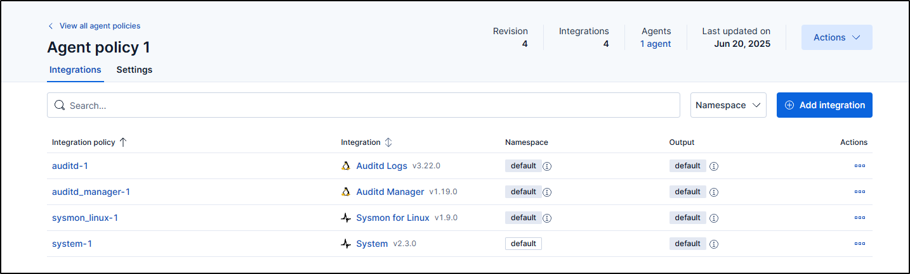
  </li>
  <li>
    Successfully added a Kali Linux agent. 
    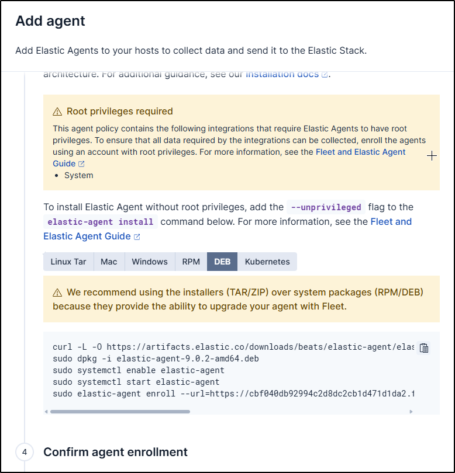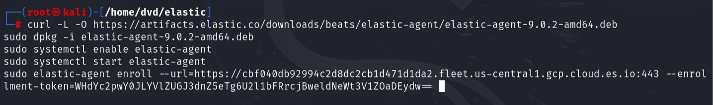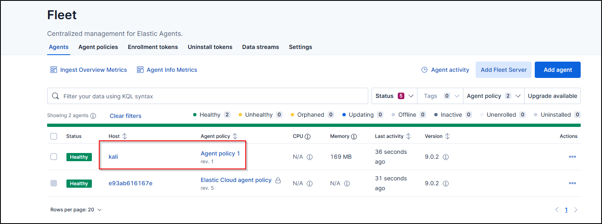
  </li>
  <li>
    Collected and searched logs. 
    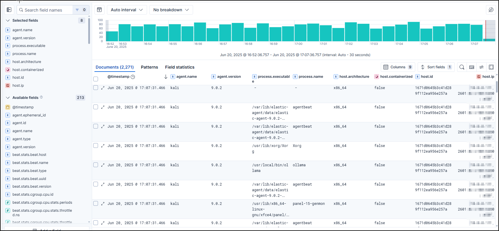
  </li>
  <li>
    Removed agent, created new policy, and added a Windows 11 agent. 
    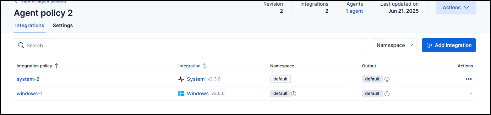
  </li>
  <li>
    Downloaded and ran Sysmon on the agent. 
    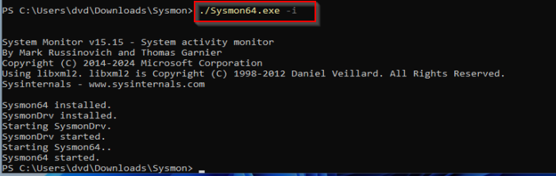
  </li>
  <li>
    Added Windows integration on the policy I made for my Windows agent on Kibana. The integration consists of Sysmon operationals, which will collect logs from Sysmon. 
  </li>
  <li>
    Searched logs with specific fields, and it successfully logged the commands I was running on the Windows 11 VM. 
    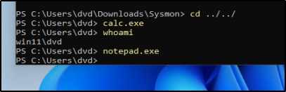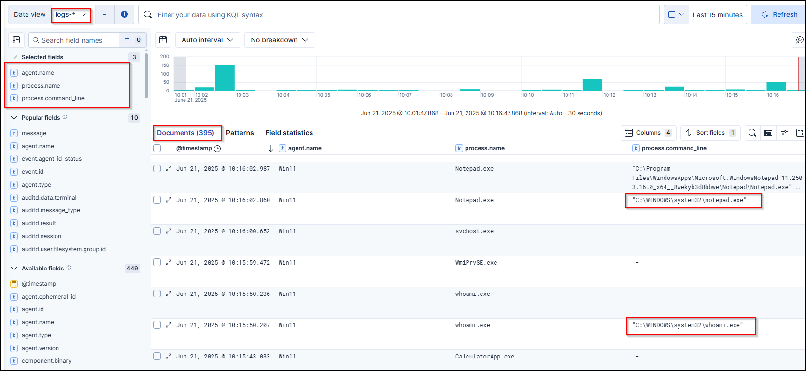
  </li>
  <li>
    Added a data filter and also used Kibana Query Language (KQL) to filter through the log searches. 
    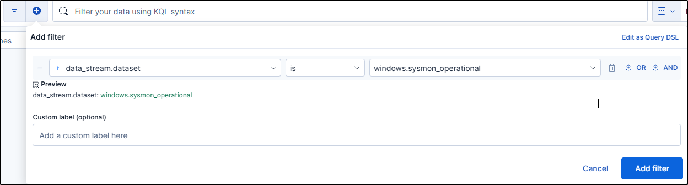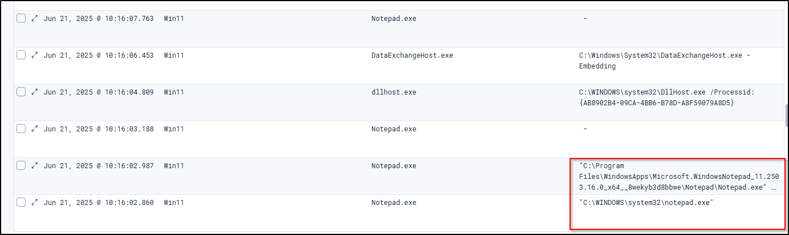
  </li>
  <li>
    Saved the Kibana Discover session to finish it off. 
  </li>
</ol>

